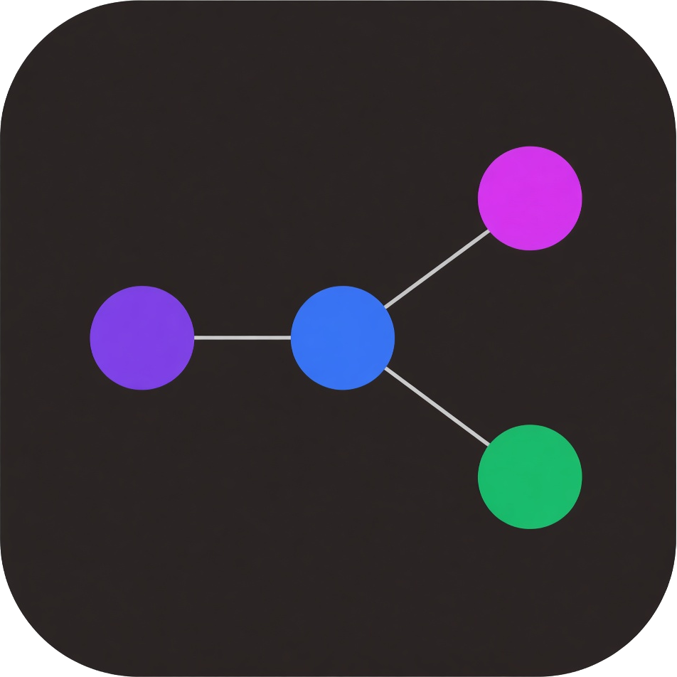

# Agent Graph

Source: https://github.com/Romstar/session-trace

Agent Graph draws a live state graph of a Cursor agent session.

Each agent action is one node. Edges show the order of those actions. Subagent work sits on a child lane. A badge at the top shows the current state: THINKING, ACTING, OBSERVING, WAITING, DONE, or ERROR.

The same VSIX runs in VS Code and in Cursor. A local ingest server starts when the editor starts. Cursor hooks post events to that server. The sidebar draws them as they arrive.

## Install the VSIX

1. In this folder, run `npm install`.
2. Run `npm run package`. This writes `agent-graph-0.1.3.vsix`.
3. Open VS Code or Cursor.
4. Open the command palette.
5. Run `Extensions: Install from VSIX...`.
6. Choose the `agent-graph-0.1.3.vsix` file.
7. Reload the window when the editor asks.

The extension activates on startup so the ingest server is up before a hook runs.

## Use it with the Cursor agent

1. Open a workspace folder.
2. Run the command `Install Agent Hooks`.
3. Click the Agent Graph icon in the activity bar.
4. Run the Cursor agent.

The graph fills as the agent thinks, calls tools, edits files, and runs shells. Click a node to read the full label, time, and payload. Use Follow live to keep the newest node in view. Use the session list when more than one session is active.

`Install Agent Hooks` adds one hook entry per Cursor event in `.cursor/hooks.json`. It does not remove hooks that were already there. `Uninstall Agent Hooks` removes only the Agent Graph entries.

## Demo without an agent

1. Start VS Code or Cursor with this extension installed, so the ingest server is running.
2. In this folder, run `npm run simulate`.

The script posts a fake session: a prompt, a thought, three tool calls (one of them a subagent), a file edit, a shell test that fails, an error, a retry, and the session end.

## Develop

- `npm run compile` typechecks the extension, the webview, and the hook, then bundles them.
- `npm run watch` rebuilds the bundles on change.
- Press F5 to launch an Extension Development Host.

Hook errors are appended to `~/.agent-graph/hook-errors.log`. The ingest port and token are in `~/.agent-graph/connection.json`. The server binds to `127.0.0.1` only. The default port is `43127`. If that port is busy, the server tries the next ports.
